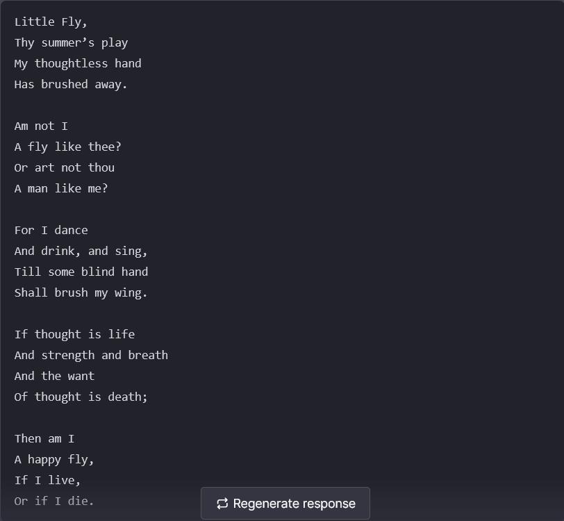

# Zendog


listen to the machine ; [Listen to the machine...](https://archive.org/download/vangelis-07.-blade-runner-blues/1993%20-%20Vangelis%20-%20Blade%20Runner%20%282013%2C%20Audio%20Fidelity%2C%20LP%209624%2C%20US%2C%2024-96%29/A2%20-%20Blush%20Response.mp3)
******************************************************************************************************************
* Zendog is a UI for OpenAI's natural language machine learning models commonly known as Chat GPT  “Generative Pre-trained Transformer”
* An api key is required for use.
*  API_KEY : https://platform.openai.com/account/api-keys

# Using zendog...
Navigate to : https://zendog-eight.vercel.app/ 
* Click on Open AI API Key (bottom left) paste your key into the box and click the tick symbol.
* You can add the UI to any webpage using the iframe script below.
* Embed zendog in web page :

   ```
  <center><iframe src="https://zendog-eight.vercel.app/" width="100%" height="1000px"></iframe></center>
   ```

* ```zendog.html``` is a ready made page for non coders , just grab it from the repo and add it to your website
  and create a link to the page from your main page.   
**********************************************************************************************************************
# Tech...
Built using ```Node.js``` , ```Next.js```, ```TypeScript```,  ```Tailwind CSS``` and ```React```.
*************************************************************************************************************************
# Mods...
* Make copies , test copies , swap them out if no problems occur.
* Clone : ```https://github.com/Mulc1b3R/zendog.git```

Modify the chat interface in `components/Chat`.
* Add required html
* Modify the sidebar interface in `components/Sidebar`.
* Edit code as required
* Modify the system prompt in `utils/index.ts`.
* Edit code as required
************************************************************************************************************************
# Audio...
* Audio files are created by writing your text in a text editor and pasting the txt in to Zendog 'Eve'.
* EVE is an 'Electronic voice emulator' : https://eve-red.vercel.app/
* Select required voice and click  ```create mp3``` , then ```Download```.
* Put the mp3 somewhere and write a path to it...
************************************************************************************************************************

# Python...
*Python3

To install the official Python bindings, run the following command:

```pip install openai```
********************************************************************************************************************
# Authorization

All API requests should include your API key in an Authorization HTTP header as follows:

Authorization: Bearer OPENAI_API_KEY= your-openai-api-key
********************************************************************************************************************
  
 # Node.js...
 
 ``` 
  import { Configuration, OpenAIApi } from "openai";
const configuration = new Configuration({
    organization: "org-g6Se7pwtJFzrBct5UisL7zAJ",
    apiKey: process.env.OPENAI_API_KEY,
});
const openai = new OpenAIApi(configuration);
const response = await openai.listEngines();
```


# python... 

```
import os
import openai
openai.organization = "org-g6Se7pwtJFzrBct5UisL7zAJ"
openai.api_key = os.getenv("OPENAI_API_KEY")
openai.Model.list()
```
**********************************************************************************************************
# Ports...

3000 localhost...http://localhost:3000/
http: 80  (Apache)

************************************************************************************************************* 
# Developement... 

**1. Clone Repo**

```
git clone : https://github.com/Mulc1b3R/zendog.git
```

**2. Install Dependencies**

```
npm i  
```

**3. Provide OpenAI API Key**

* Create a .env.local file in the root of the repo with your OpenAI API Key:
* rename file ```.env``` , remember not to expose your key in public , remove key from repo ,e.t.c.
* .env format , as below (save file as .txt).
```
OPENAI_API_KEY=YOUR_KEY
```
**4. Run App**
```
npm run dev
```
**5. Use It**

You should be able to start chatting........ENJOY!!!

## Wamp server: 3.3.0
Apache Version:2.4.54.2:
MySQL Version:
8.0.31 
MariaDB Version:
10.10.2
Download Here : https://www.wampserver.com/en/download-wampserver-64bits/
UniServer :
ZeroXV - 15.0.2
Apache 2.4.58 VS17
MySQL 8.2.0
PHP 7.0 to 7.4, 8.0, 8.1, 8.2, 8.3
Dowload Here: https://sourceforge.net/projects/miniserver/files/Uniform%20Server%20ZeroXV/

## Output...



*****************************************************************************************************************************

## Contact...

* Any questions ?
* Drop us a line @

* mojo@psicodata.io 
* disobay@proton.me
*******************************************************************************************************************************

  ```
  MADE IN YORKSHIRE BY PSICO COMMUNICATIONS.
  ```

